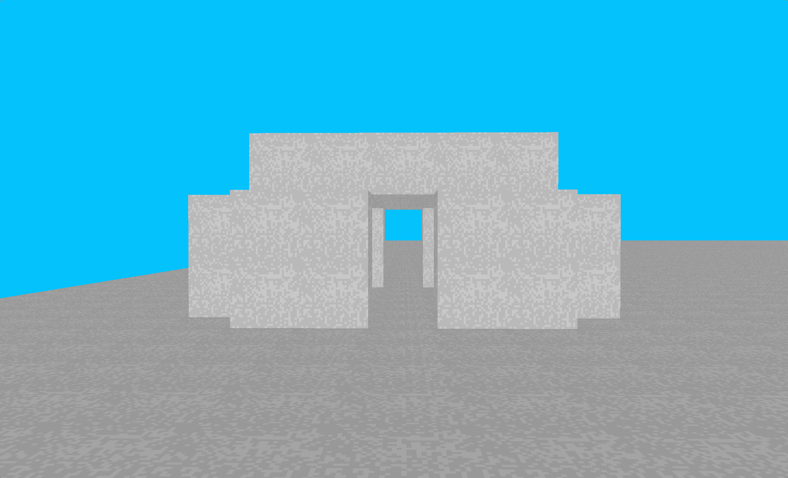

# rinsedmeat

A small voxel engine I've written with Odin and SDL_GPU to learn some basics
about programming. Terrain generation is not implemented, nor are some quality
improvements such as antialiasing and mipmapping. Still, basic camera controls
and block editing are present.

Some remaining features that may be implemented include swapping textures and
being able to place several block types. Much of the logic is ready in the
texture allocation and shader, I simply have not wired this up fully and
added the texture index into the data layout for the shader.

I also still need to do some work to annotate this code with better comments and
explanations. I intend to do a writeup when I go through the hassle of creating
a personal website for myself again.

## Dependencies
- Odin compiler, dev 2025-08 (or later)
- SDL3
- SDL3_image

Both of the SDL libraries use Odin's vendored bindings.

I recommend the Odin programming language a lot if you want to learn some basic
systems programming or graphics! I have been finding it pretty easy to learn,
it is very easy to get up and running coming from C, and has less footguns and
an easier time building.

I have been compiling and running my program on the dev-2025-08 build of Odin,
under the latest Arch Linux, with SDL3_image installed from the AUR.

If you are running on macOS, you probably need to figure out how to compile
and link with MoltenVK. I am unsure how well this works; I have not yet
tested on macOS as I have shifted my personal usage towards Linux.

No clue on Windows. It likely requires you install the SDL libraries. I have
zero desire to run Microsoft's operating system ever again, but my impression
is Odin's standard library should be cross-compatible, as should SDL. But maybe
you will take this as an opportunity to try Linux? :P

## Copyright
This code is licensed under the Creative Commons Zero license. Please freely
study, learn, or reuse the code. No need to attribute.
